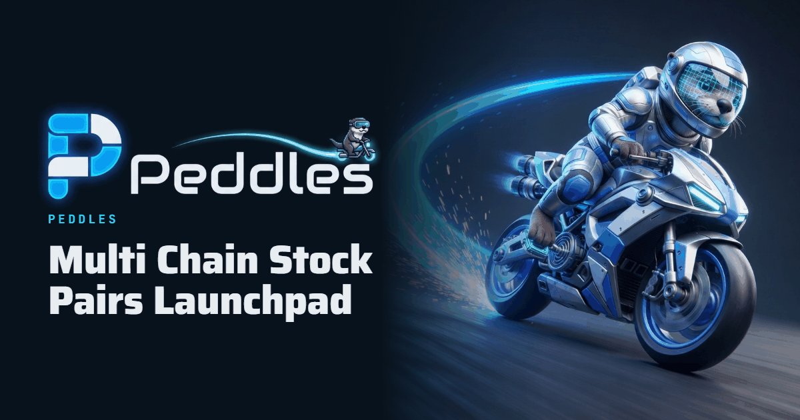

<p align="center">
  
</p>

# Peddles SDK

TypeScript SDK for **[Peddles](https://peddles.xyz)** — the multi-chain launchpad for memecoins
**paired against tokenised stocks** (and ETH), with a fixed-at-launch fee model, a built-in
anti-sniper tax and holder rewards paid in the pool's own quote asset.

Read launches from the chain, build launch transactions for your users to sign, and decode what
went wrong when one reverts — with the same code the Peddles app runs.

- 🌐 **Website:** [peddles.xyz](https://peddles.xyz) · **App:** [pro.peddles.xyz](https://pro.peddles.xyz) · **Swap:** [peddleswap.xyz](https://peddleswap.xyz) · **Terminal:** [terminal.peddles.xyz](https://terminal.peddles.xyz)
- 📚 **Docs:** [docs.peddles.xyz](https://docs.peddles.xyz) · **Developers:** [dev.peddles.xyz](https://dev.peddles.xyz)
- 🤖 **Integrating with an AI coding agent?** Paste [`CLAUDE_PROMPT.md`](./CLAUDE_PROMPT.md) into Claude (or any agent).

---

## Chains

| Chain | Chain id | Status | Explorer |
| --- | --- | --- | --- |
| **Base** | 8453 | ✅ Live — mainnet | [base.blockscout.com](https://base.blockscout.com) · [basescan.org](https://basescan.org) |
| **Sepolia** | 11155111 | ✅ Live — testnet (mock stock legs, no dollar value) | [sepolia.etherscan.io](https://sepolia.etherscan.io) |
| Robinhood Chain | 4663 | 🔜 Coming soon | [robin.etherscan.io](https://robin.etherscan.io) |
| Arc | 5042 | 🔜 Coming soon | — |
| BNB Smart Chain | 56 | 🔜 Coming soon | [bscscan.com](https://bscscan.com) |

The SDK ships an address book **only for chains with a live deployment**. `supportedChains()` is the
source of truth; a chain that is not in it throws `UnknownChainError` rather than falling back to
another chain's addresses. Every address in `DEPLOYMENTS` was confirmed to have code on its chain
before it was published (`npm run smoke` re-checks them live).

## What Peddles does (what you can build on)

| Feature | What it is |
| --- | --- |
| **Stock-paired launches** | A coin whose pool is paired against a tokenised stock (Coinbase B20 on Base, Robinhood tokens on 4663, bStocks on BSC). Holders are rewarded in that stock. |
| **ETH-paired launches** | The classic shape — a coin paired against WETH on Uniswap v4. |
| **Clog launches** | A launch type that holds back a slice of supply and releases it into the pool in small, time-spaced slices (≤ 3 hours for the whole clog). |
| **Handle launches** | Launches whose creator fees accrue to an X (Twitter) account's pot, claimable by that account. |
| **NFT bonding → DEX** | NFT collections sold on a bonding curve that graduate automatically into a DEX pool when they sell out. |
| **Art → DEX / NFT → stock graduation** | Collections graduating into a stock-paired coin, with an optional share of fees committed to NFT holders. |
| **One fee model, fixed at launch** | Every launch pool runs through `PeddlesFeeHook`: the creator picks an all-in tax (1–10%) and the split of the excess between themselves and holders **in the launch transaction**, and nobody can change either afterwards. |
| **Anti-sniper opening tax** | 20% on the first block, decaying to the pool's normal tax over ~3 minutes. The creator's own buy in the launch transaction pays the normal rate. |
| **Holder rewards** | Paid in the pool's quote asset (a TSLA-paired coin pays TSLA), deployed and bound inside the launch transaction. |
| **Uniswap v4 venue** | Pools are native Uniswap v4 pools, identified by the Peddles fee hook address. |

Fee legs (constants in the contract, exposed by the SDK): **0.50% platform + 0.50% creator** are fixed
inside every pool's tax; everything above them is split between the creator and holders at the
creator's chosen ratio. `feeSplit()` computes it exactly.

## Install

```bash
npm install github:peddles-markets/peddles-sdk viem
```

`viem` (v2) is a peer dependency. The package is ESM and ships its TypeScript types.

## Quick start

```ts
import { createPublicClient, http } from 'viem';
import { base } from 'viem/chains';
import { supportedChains, addressOf, getTokenInfo, getPoolTerms, feeSplit } from '@peddles/sdk';

const client = createPublicClient({ chain: base, transport: http() });

supportedChains();                           // [11155111, 8453]
addressOf(8453, 'PeddlesFactoryV20');        // 0x90bD4d38F621529b4aD6480c221075B7317b1978

// Identity and supply, read from the token itself — never assume 18 decimals.
const info = await getTokenInfo(client, token);

// The pool's permanent terms (tax, holder split, rewards distributor), read from the fee hook.
const terms = await getPoolTerms(client, 8453, token);

// Exactly where a fee goes. bigint in, bigint out — no floating point anywhere.
const split = feeSplit(terms.creatorTaxBps, terms.excessToCreatorBps, 1_000_000n);
```

### Build a launch for a user to sign (ETH-paired)

```ts
import {
  launchAddressesFor, buildWethLaunchPlan, buildWethLaunchCall, encodeWethLaunchCall,
  readOrchestratorLaunchFee, randomSalt, validateFeeTerms, decodeLaunchRevert,
} from '@peddles/sdk/launch';

const addresses = launchAddressesFor(8453);
const salt = randomSalt();   // or mineSalt({...}) for a vanity `…1978` token address, like the Peddles app
const plan = await buildWethLaunchPlan(client, addresses, { salt, variant: 0 });   // 0 = plain launch
const { launchFee: launchFeeWei } = await readOrchestratorLaunchFee(client, addresses.orchestrator); // read, never assumed

const feeTerms = { taxBps: 300n, excessToCreatorBps: 5000n };                     // 3%, half the excess to holders
const issue = validateFeeTerms(feeTerms);                                        // null when valid
if (issue) throw new Error(`${issue.field}: ${issue.code}`);

const call = buildWethLaunchCall(
  { name: 'My Coin', symbol: 'MINE', salt, creator: user, feeTerms,
    metadata: { contractUri: '', image: 'ipfs://…', website: '', x: '', telegram: '' },
    plan, devBuyWei: 0n, minTokensOut: 0n, launchFeeWei },
  addresses.orchestrator,
);
const tx = encodeWethLaunchCall(call, addresses.orchestrator);   // { to, data, value } — hand to the wallet

// If it reverts, say why in words:
try { /* send tx */ } catch (e) { console.log(decodeLaunchRevert(e)); }
```

Stock-paired launches use `buildStockLaunchCall` / `encodeStockLaunchCall` with `readStockQuotes()`
(the whitelisted stock legs) and `readStockLaunchFee()`. Clog and NFT helpers live in the root export
(`getClogState`, `clogShareOfInflows`, `graduateAndBuyRequest`, …).

## Rules the SDK follows — and your integration should too

1. **Money is `bigint` in base units, always.** Never route an amount through a JS `number`. Every
   amount travels with its `decimals`; format only at the render edge. B20 stock legs on Base are
   **8 decimals**, Robinhood's 18, USDG 6.
2. **The chain is the source of truth.** Read a token's name, supply, decimals, pool terms and lock
   status from the chain; use an API only for what the chain can't answer (logos, 24h volume, candles).
3. **No silent defaults.** An unknown chain, token or venue throws. Never fall back to another chain.
4. **A stock token is priced by its multiplier, never one-to-one with the share.**
5. **Metadata is user-supplied and hostile.** Escape it; never render it as HTML.

## Scripts

```bash
npm run build       # dist/
npm test            # unit tests, including constants pinned against the contract sources
npm run smoke       # LIVE: every address in the book has code on its chain (read-only, no key)
```

## License

MIT © Peddles
